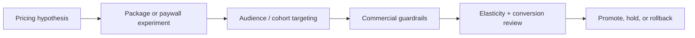

# Pricing Experiment Studio

Premium React + TypeScript workspace for packaging experiments, price anchoring, elasticity readouts, and executive pricing decisions.

## Executive Summary

Pricing changes are easy to frame as design tweaks or finance-side adjustments. In reality, they alter trust, activation, plan selection, procurement confidence, and long-term revenue mix. Pricing Experiment Studio treats monetization changes like a controlled operating system: hypotheses are visible, guardrails are explicit, and rollout decisions stay tied to commercial outcomes.

## Recruiter Takeaway

This project shows product sense and operator thinking at the same time. It is designed like an internal tool for teams that need to test pricing without damaging conversion quality or executive trust.

## Tech Stack

[](https://react.dev/)
[](https://vite.dev/)
[](https://www.typescriptlang.org/)
[](https://developer.mozilla.org/en-US/docs/Web/CSS)
[](https://vitest.dev/)
[](https://opensource.org/license/mit)

## Overview

| Area | What it covers |
| --- | --- |
| Commercial pressure | ARR exposure, conversion lift, elasticity confidence, rollback watch |
| Package architecture | Multi-tier comparison designed for packaging and price-shape tests |
| Live portfolio | Promote / hold / rollback pricing experiments |
| Elasticity map | Segment-sensitive response to pricing pressure |
| Scenario board | Which commercial outcome each pricing strategy optimizes for |
| Guardrails + action queue | Rollout discipline and next-step execution |

## Business Problem

Most pricing changes fail because teams optimize one outcome in isolation:

- more immediate cash
- higher ARPA
- cleaner pricing page conversion
- simpler package ladder

What gets missed is the interaction between those gains and the downstream cost:

- worse activation quality
- lower enterprise trust
- procurement friction
- more support burden
- distorted pipeline mix

This project models pricing as a workflow where commercial upside and operational downside must be visible at the same time.

## Architecture / Workflow



## What An Engineering Leader Sees Here

- A frontend system shaped around pricing operations, not generic dashboard filler
- Clear commercial-state modeling: tests, cohorts, guardrails, scenario framing, action queues
- A design language that supports narrative comparison instead of widget clutter
- UI decisions anchored to GTM and monetization logic

## Screenshots

### Hero Capture


### Package Architecture


### Elasticity and Cohort Readout


### Guardrails and Action Queue


## Local Run

```powershell
Set-Location "C:\Users\chaus\dev\repos\pricing-experiment-studio"
npm install
npm test
npm run build
npm run dev
```

## Portfolio Links

- [Kinetic Gain](https://kineticgain.com/)
- [Skills / Portfolio](https://mizcausevic.com/skills/)
- [LinkedIn](https://www.linkedin.com/in/mirzacausevic)
- [Medium](https://medium.com/@mizcausevic)
- [GitHub](https://github.com/mizcausevic-dev)
