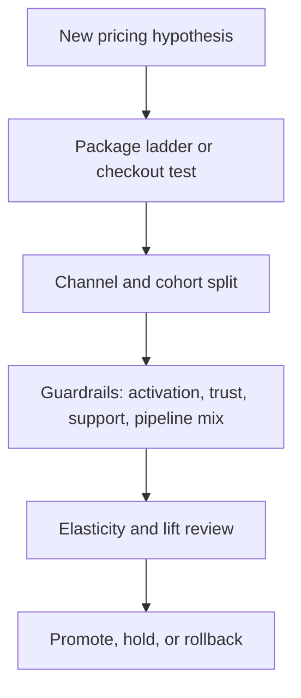

# Pricing Experiment Studio Architecture

## Product Intent

Pricing Experiment Studio is meant to feel like an internal commercialization workspace, not a static pricing-page mockup. The interface is designed to support:

- pricing and monetization teams
- growth operators
- product marketing
- revenue operations
- executives reviewing pricing risk

## Workflow View

## Interface Blocks

- **Hero narrative**: frames pricing as a controlled revenue system.
- **Commercial pressure panel**: summarizes the amount of ARR and conversion influence under test.
- **Package architecture**: compares tiers, value framing, and price shape.
- **Live portfolio**: keeps pricing experiments visible as decisions rather than isolated tests.
- **Elasticity map**: explains where segments tolerate price pressure differently.
- **Scenario board**: shows which pricing strategy optimizes for which commercial outcome.
- **Guardrails and action queue**: turns monetization learning into execution.
